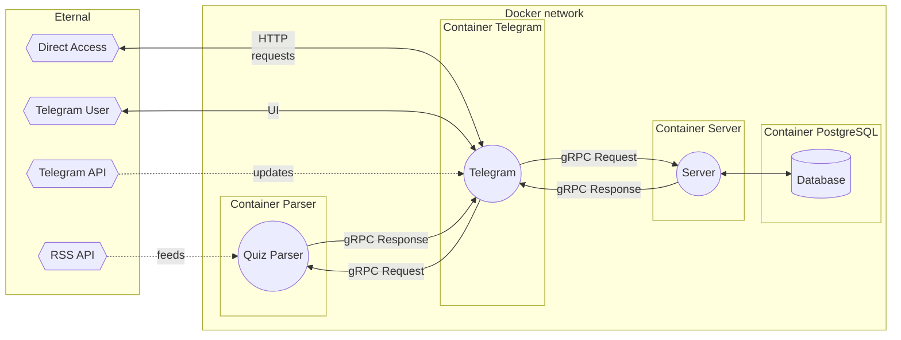

# Telegram bot Викторина "Что-Где-Когда?" на Go


## Идея
Идея проекта - телеграм-бот, который позволяет запустить в чате викторину ЧГК. Пользователю задается вопрос, в течение 60 секунд надо дать правильный ответ.
## Концепт
Пользователь может:
- выбрать случайный вопрос
- посмотреть свою статистику (количество верных решений / всего решений)
- посмотреть общий рейтинг игроков
- посмотреть свое место в общем рейтинге

Сервис бота:
- парсинг вопросов и ответов из открытой базы https://db.chgk.info/
- проверка правильного ответа пользователя
- запускает таймер на время ответа пользователя
- регистрация пользователя в БД
- сохранение статистики пользователей в БД



## Требования

1. Сервис должен предоставлять gRPC интерфейс
2. Сервис должен предоставлять HTTP интерфейс как прокси к gRPC интерфейсу (через grpc-gateway).
3. Интерфейс бота, используемый в мессенджере, должен быть продублирован через gRPC/HTTP ручки.
4. Сервис должен использовать миграции при работе с БД
5. сервисом можно взаимодействовать через интерфейс какого-либо мессенджера (в приоритете Mattermost и Telegram)
6. Сервис должен хранить конфигурацию в yaml файлах
7. Сервис должен быть завернут в докер.


## Docker контейнеры
- Parser
- Telegram
- PostgreSQL
- Server

## Перед устновкой
1. Создать бота в телеграме
2. Указать telegram token в configs/telegram_config.yaml
3. Настроить имя базы данных, пользователя и пароль в configs/docker/.env и server/telegram_config.yaml

## Устновка
- Сборка и запуск контейнеров
```
make
```
- Остановка контейнеров
```
make docker-stop
```
- Очистка всех неиспользуемых или не связанных с контейнерами образов, контейнеров, томов и сетей
```
make docker-prune
```
